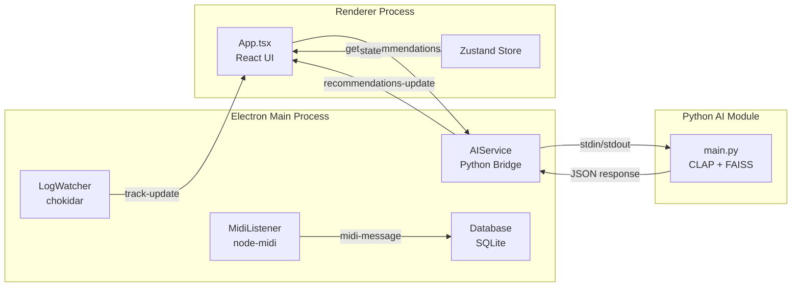

# DrillMusic App 개발 계획

## 현재 상태 분석

프로젝트는 다음과 같이 구성되어 있습니다:

**완료된 작업:**

- ✅ Electron + Vite + React + TypeScript 환경 구축
- ✅ 기본 UI 컴포넌트 ([`app/src/App.tsx`](app/src/App.tsx))
- ✅ Zustand 스토어 ([`app/src/stores/useAppStore.ts`](app/src/stores/useAppStore.ts))
- ✅ 서비스 클래스 구현 (Database, LogWatcher, MidiListener, AIService)
- ✅ Python AI 모듈 ([`ai/src/main.py`](ai/src/main.py) - CLAP 기반 추천)

**미완성 부분:**

- ❌ 서비스가 [`app/electron/main.ts`](app/electron/main.ts)에서 초기화되지 않음
- ❌ IPC 핸들러가 플레이스홀더만 존재
- ❌ preload API가 제한적 ([`app/electron/preload.ts`](app/electron/preload.ts))
- ❌ UI가 하드코딩된 데이터만 표시
- ❌ AI 서비스와의 실제 데이터 흐름 미구현

## 개발 단계

### 1. Electron 메인 프로세스 통합

[`app/electron/main.ts`](app/electron/main.ts)에 모든 서비스 초기화 및 연결:

```typescript
// 서비스 인스턴스 생성
- Database 초기화 (initDatabase)
- LogWatcher 인스턴스화 및 시작
- MidiListener 인스턴스화
- AIService 인스턴스화 및 Python 프로세스 시작
```

**고려사항:**

- AI 서비스의 Python 스크립트 경로를 개발/프로덕션 환경에 맞게 설정
- 에러 핸들링 및 로깅 추가

### 2. IPC 통신 구현

**필요한 IPC 채널:**

**Main → Renderer (send):**

- `track-update`: 로그 파일에서 감지된 새 트랙 정보
- `recommendations-update`: AI가 반환한 추천 곡 리스트
- `midi-message`: MIDI 이벤트 스트림

**Renderer → Main (invoke/handle):**

- `get-current-track`: 현재 재생 중인 트랙 정보 조회
- `get-recommendations`: AI 추천 요청
- `list-midi-devices`: 연결된 MIDI 장치 목록
- `select-midi-device`: MIDI 장치 선택
- `set-log-path`: DJ 소프트웨어 로그 파일 경로 설정
```typescript
// app/electron/main.ts
ipcMain.handle('get-recommendations', async (event, currentTrack) => {
  aiService.getRecommendation(currentTrack);
  // Python 프로세스로부터 응답 대기 후 반환
});
```


### 3. Preload API 확장

[`app/electron/preload.ts`](app/electron/preload.ts)에 다음 추가:

```typescript
contextBridge.exposeInMainWorld('electronAPI', {
  // 기존
  getCurrentTrack: () => ipcRenderer.invoke('get-current-track'),
  onTrackUpdate: (callback) => ipcRenderer.on('track-update', callback),
  
  // 추가
  getRecommendations: (track) => ipcRenderer.invoke('get-recommendations', track),
  onRecommendationsUpdate: (callback) => ipcRenderer.on('recommendations-update', callback),
  listMidiDevices: () => ipcRenderer.invoke('list-midi-devices'),
  selectMidiDevice: (id) => ipcRenderer.invoke('select-midi-device', id),
  setLogPath: (path) => ipcRenderer.invoke('set-log-path', path),
});
```

TypeScript 타입 정의도 추가 ([`app/src/vite-env.d.ts`](app/src/vite-env.d.ts))

### 4. AI 서비스 통신 개선

[`app/electron/services/AIService.ts`](app/electron/services/AIService.ts) 개선:

- Python 프로세스와의 JSON 기반 stdin/stdout 통신 강화
- 추천 요청 후 응답을 Promise로 반환하도록 개선
- 에러 핸들링 및 타임아웃 추가
```typescript
// 현재: 응답 대기 없이 stdin에 쓰기만 함
// 개선: stdout에서 JSON 파싱 후 Promise resolve
```


### 5. UI 업데이트

[`app/src/App.tsx`](app/src/App.tsx) 개선:

- 하드코딩된 추천 데이터를 실제 AI 추천으로 교체
- `recommendations` 상태를 Zustand 스토어에서 가져와 렌더링
- 트랙 변경 시 자동으로 추천 요청
```typescript
useEffect(() => {
  if (currentTrack && window.electronAPI) {
    window.electronAPI.getRecommendations(currentTrack).then(recs => {
      setRecommendations(recs);
    });
  }
}, [currentTrack]);
```


### 6. 테스트 환경 구성

**로그 파일 테스트:**

- 테스트용 더미 로그 파일 생성 및 감시 테스트

**AI 추천 테스트:**

- Python 인덱스 빌드 (`ai/src/main.py build`)
- Electron 앱에서 추천 요청 테스트

## 아키텍처 흐름



## 주의사항

1. **Python 프로세스 관리**: AI 서비스는 앱 시작 시 Python 프로세스를 spawn하고, 앱 종료 시 정리해야 합니다.

2. **비동기 통신**: AI 추천은 수 초가 걸릴 수 있으므로 UI에 로딩 상태 표시가 필요합니다.

3. **MIDI 장치**: 실제 DJ 컨트롤러가 없어도 앱이 동작하도록 graceful degradation 구현이 필요합니다.

4. **로그 파일 경로**: 초기에는 하드코딩하거나 환경변수로 설정하고, 향후 설정 UI를 추가합니다.

## 다음 단계 (이번 개발 이후)

- DJ 소프트웨어별 로그 파서 구체화 (Rekordbox/Serato)
- MIDI 매핑 설정 UI
- 세션 히스토리 뷰어
- 추천 알고리즘 튜닝 (goal 파라미터 UI 연동)